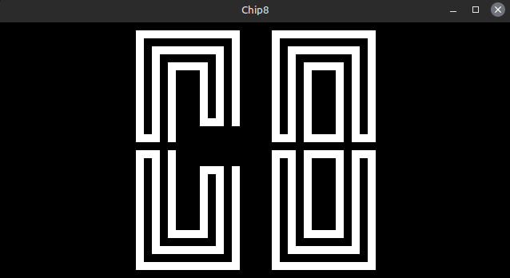

# CHIP-8 Emulator (C++)

This project implements a CHIP-8 emulator in C++, using SFML for graphics. The emulator simulates the behavior of the classic CHIP-8 virtual machine, allowing you to run CHIP-8 games and programs.

[]


## Features
- **C++ implementation** of CHIP-8 emulator.
- **SFML** used for rendering the display and handling input.
- **Google Test** used for unit testing the emulator's components.

## Build & Installation

### Prerequisites
- C++17 or higher
- CMake (for building the project)
- SFML (for graphics and input handling)
- Google Test (for testing)

### Instructions
1. Clone the repository:
    ```bash
    git clone https://your-repo-url.git
    cd chip8-project
    ```

2. Create the build directory:
    ```bash
    mkdir build
    cd build
    ```

3. Run CMake to generate the build files:
    ```bash
    cmake ..
    ```

4. Build the project:
    ```bash
    make
    ```

5. Run the emulator (replace `game.ch8` with your ROM file):
    ```bash
    ./chip game.ch8
    ```

